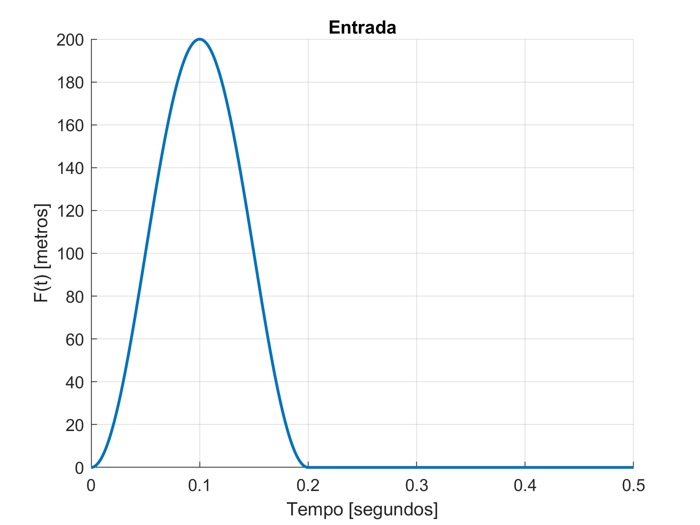
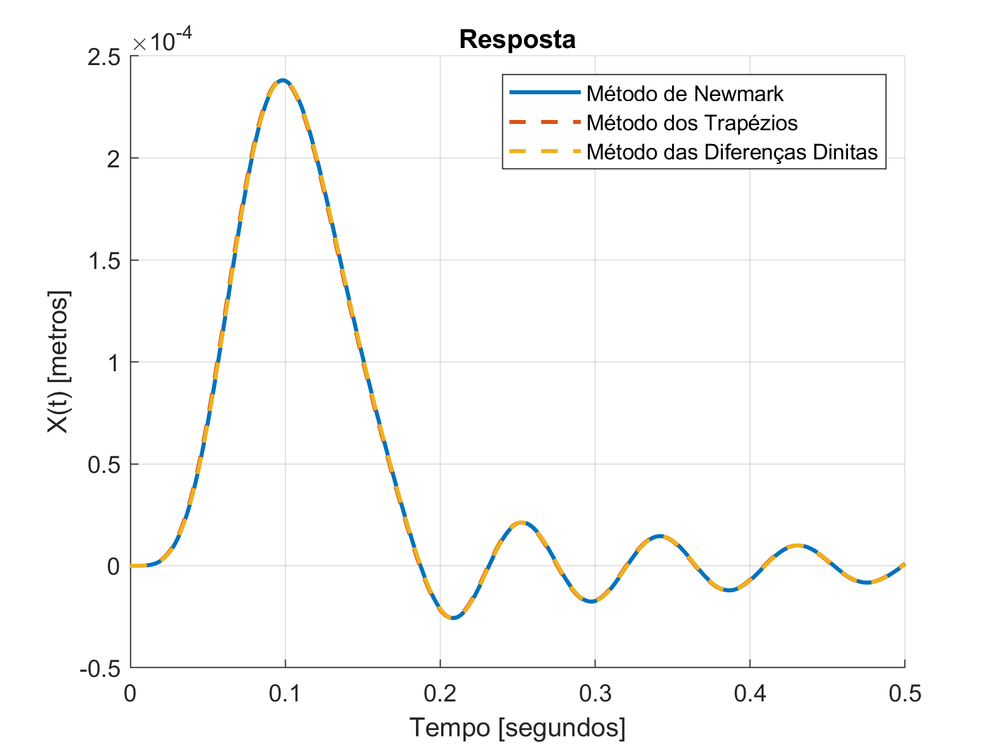
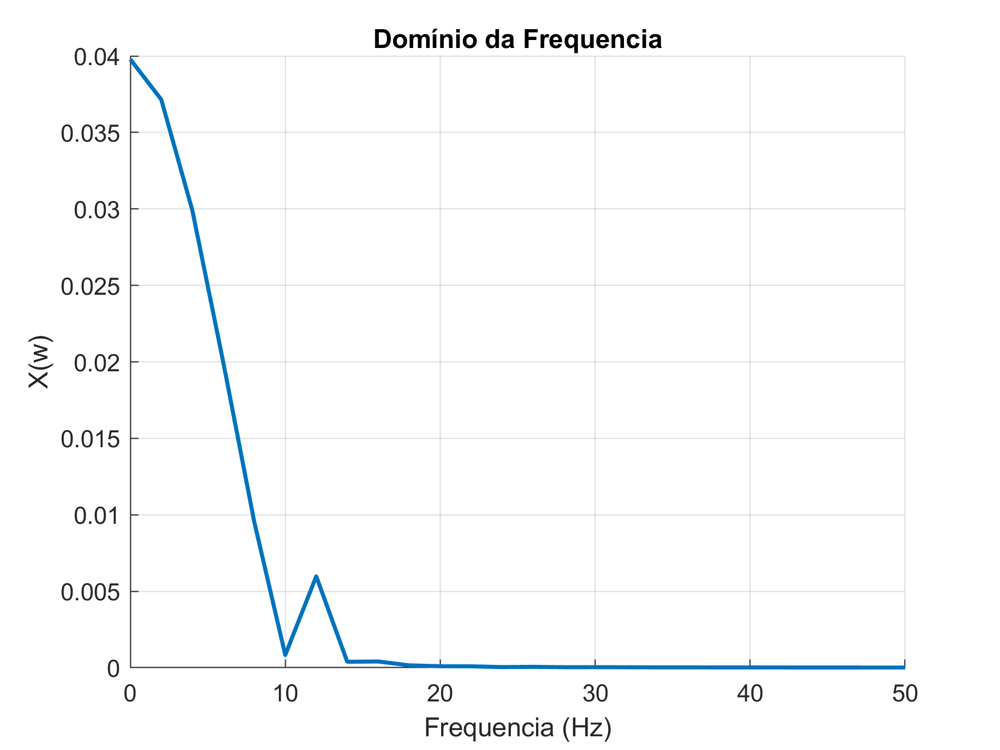

# Trabalhos de dinâmica estrutural

## Atividade 1

O código da atividade 1 está no arquivo [atividade1.m](atividade1.m).
Entrada:

Resposta:

Dominio da frequência:

Resposta reconstruída a partir do domínio da frequência:

